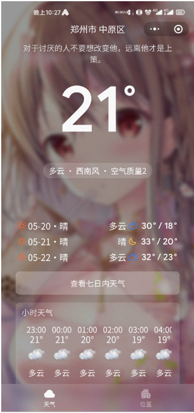

## 天气小程序源码

来体验呀,小giegie

更新日志：

**2021.5.18**

1.将设置、定位等信息上传至云端，使我在打开时无需授予定位权限

2.Bug fixed

**2021.5.16**

1.删除天气API，均使用和风天气API

2.完善24小时天气预报

3.Bug fixed

**2021.5.15**

1.增加重新定位及手动选择定位按钮

Revincx寒假写的一个天气小程序

截图：

